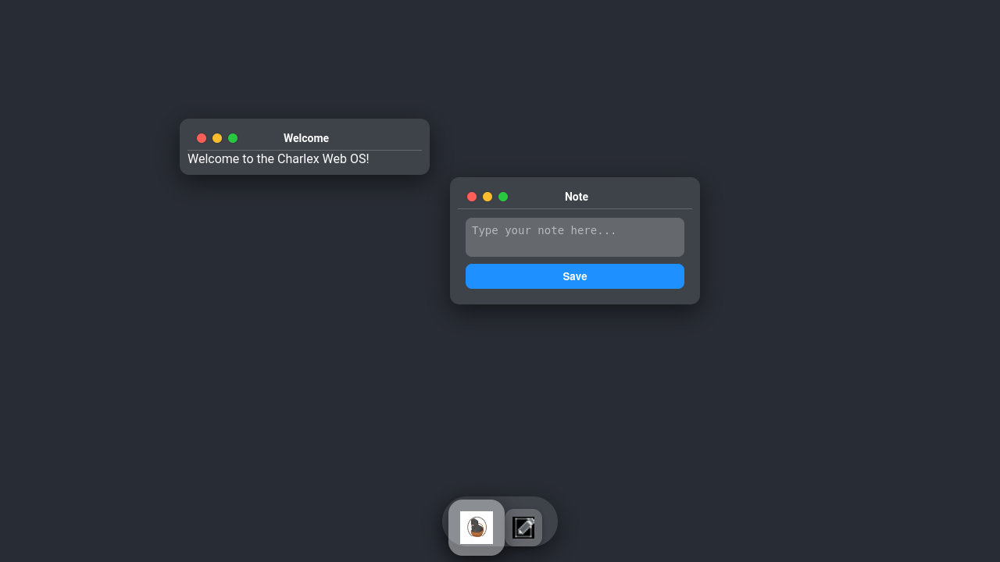

# Charlex WebOS

A simple web-based operating system simulation built with pure JavaScript, running entirely in the browser. A i'm Googler but dont like Java, because javascript is here!

## Requirements

- A modern web browser (Chrome recommended).

## How to Use

1. Open `index.html` in your browser.
2. Interact with the desktop, windows, and dock.

## Features

- Draggable windows.
- Dock with icons.
- Note-taking with encryption.
- File explorer for encrypted files.
- CPU monitoring (simulated).
- Linux shell simulation.
- Power controls (simulated).
- Network simulation.
- Mode toggle (macOS/Windows styles).

## Development

- JavaScript files in `js/` directory.
- CSS in `css/` directory.
- No backend required.

## License

MIT License.

Copyright (c) 2020-2025 AMZY31 (Amin Azimi)

### Screenshots

