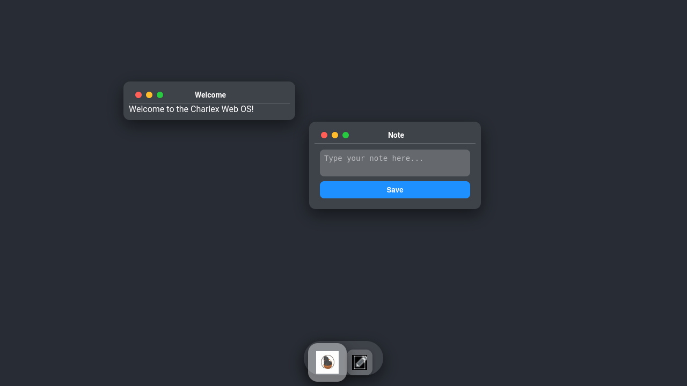

# 🖥️ Charlex WebOS

Welcome to **Charlex WebOS**! 🚀 A sleek web-based simulation of a real operating system. It's user-friendly, visually appealing, and mimics the look and feel of a genuine OS. Built with Python 🐍 and Flask 🌐, this project is perfect for learning, experimenting, and expanding.

## ✨ Features

- **Free and Open Source** 📖
- **Fast and Easy to Use** ⚡
- **Modular Design** 🧩 – Easily add new features
- **Web-Based Interface** 🌐 – No installation required
- **Explicit User Authentication** 🔐 – Secure login and registration
- **Secure File Storage** 💾 – Encrypted WebDisk app

## 📋 Prerequisites

To run Charlex WebOS, ensure you have:

- 🐍 Python 3.6+
- 🌐 Flask web framework

## 🚀 Quick Start

### 1. Set Up Virtual Environment

Create and activate a Python virtual environment:

```bash
python3 -m venv venv
source venv/bin/activate  # On Windows: venv\Scripts\activate
```

### 2. Install Dependencies

Install the required packages:

```bash
pip install -r requirements.txt
```

### 3. Run the Application

Start the Flask development server:

```bash
python app.py
```

Open your browser and navigate to `http://localhost:5000` to explore Charlex WebOS! 🎉

## 📁 Project Structure

```
charlex-webos/
├── app.py                 # Main Flask application
├── models.py              # Database models (User, File)
├── webdisk.py             # WebDisk blueprint for secure file storage
├── window_manager.py      # Window management logic
├── templates/             # HTML templates
│   └── index.html         # Main OS desktop
├── static/                # Static assets (CSS, JS, images)
├── requirements.txt       # Python dependencies
├── README.md              # This file
└── LICENSE                # Project license
```

### Key Components

- **🖥️ Source Files:** `app.py` and `window_manager.py` handle core functionality and window management.
- **🎨 Templates:** HTML files in `templates/` for the UI.
- **📦 Static Files:** Images, styles, and scripts in `static/`.
- **🔐 Authentication:** User login/registration for secure access.
- **💾 WebDisk:** Encrypted file upload/download within the OS.

## 🤝 Contributing

We love contributions! 💖 Here's how you can help:

1. 🍴 Fork the repository
2. 🌿 Create a feature branch: `git checkout -b feature/amazing-feature`
3. 💻 Make your changes and commit: `git commit -m 'Add amazing feature'`
4. 📤 Push to the branch: `git push origin feature/amazing-feature`
5. 🔄 Open a Pull Request

Please follow the existing code style and add comments where necessary. Let's build something awesome together! 🚀

## 📚 Documentation

- [Flask Official Docs](https://flask.palletsprojects.com/) 🌐
- [SQLAlchemy Docs](https://sqlalchemy.org/) 🗄️
- [Flask-Login Docs](https://flask-login.readthedocs.io/) 🔐

## 📄 License

This project is licensed under the terms in the [LICENSE](./LICENSE) file. 📜

---

## 🎯 Project Overview

Charlex WebOS is a web-based OS simulation that provides an intuitive, desktop-like experience. Inspired by the Gnu/Linux community 🐧, it's designed for ease of use and extensibility.

### Why Charlex WebOS?

- **Intuitive UI:** Drag-and-drop windows, dock icons, and familiar OS elements.
- **Secure Apps:** Integrated WebDisk for encrypted file management.
- **Extensible:** Add new apps, features, and themes effortlessly.
- **Educational:** Great for learning web development and OS concepts.

### Screenshots

 🖼️

---

*Made with ❤️ by the open-source community. Happy coding! 🎉*
