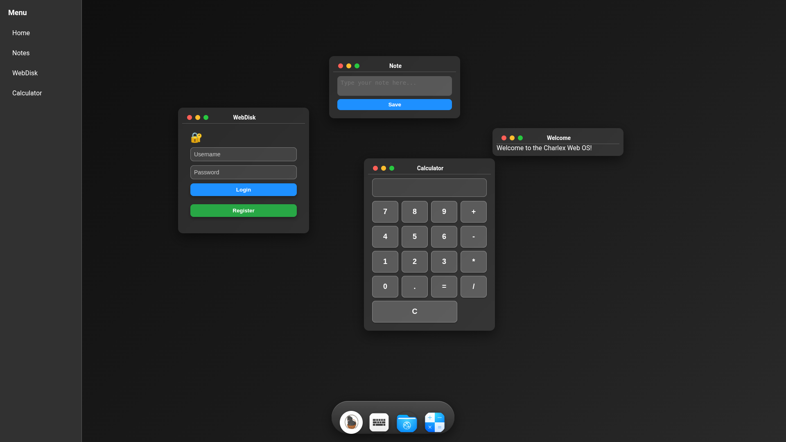

# 🖥️ Charlex Management Panel (CharleX MP)

A simple web-based managment system simulation. Built with Python 🐍 and Flask 🌐. Easy to use, open source, and focused on simplicity and libertarian liberty. SIMPLE UNIX MANAGMENT PANEL WITH shell without any waranty just made with <3 for open-source fucking GNU/Linux community!

Creator: Aamin Azimi (AMZY31)

## ✨ Features

- Free and open source 📖
- Web-based – no install needed 🌐
- Simple and fast ⚡
- Secure login and file storage 🔐💾
- Built-in WebDisk for encrypted file management 💾
- Interactive Shell Terminal for command execution 🖥️
- Easy to add new features 🧩

## 🖥️ Shell Terminal

The Charlex Management Panel includes an interactive shell terminal accessible via the web UI. You can execute shell commands directly from the browser, view outputs, and manage command history. This feature allows for quick system interactions without leaving the application.

To use the shell terminal:
1. Open the Shell Terminal window from the menu or dock.
2. Enter commands in the input field and press Enter or click Execute.
3. View the output in the terminal area.
4. Use the Clear button to reset the output.

**Note:** Commands are executed on the server-side, so ensure proper security measures are in place for production use.

## 📋 What You Need

- Python 3.6 or newer 🐍
- Flask (install with pip) 🌐

## 🚀 Get Started

1. Create a virtual environment:
   ```
   python3 -m venv venv
   source venv/bin/activate  # Windows: venv\Scripts\activate
   ```

2. Install packages:
   ```
   pip install -r requirements.txt
   ```

3. Run the app:
   ```
   python app.py
   ```

4. Open http://localhost:5000 in your browser. 🎉

## 📁 Project Files

- app.py: Main app 🖥️
- models.py: Database stuff 🗄️
- webdisk.py: File storage 💾
- ui_components.py: UI components and window management 🪟
- shell.py: Shell terminal functionality 🖥️
- templates/: HTML pages 🎨
- static/: CSS, JS, images 📦
- requirements.txt: Needed packages 📋

## 🤝 Contributing

Fork the repo, make changes, and send a pull request. Keep it simple! 🚀

## 📄 License

See LICENSE file. 📜

## 🎯 Why Charlex Management Panel (CharleX MP)?

We believe in simplicity and libertarian liberty. Avoids unnecessary complexity and restrictions. Users have full control over their experience. Inspired by free software and libertarian principles – freedom to use, modify, and share without limits. 🕊️

### Screenshots

  


