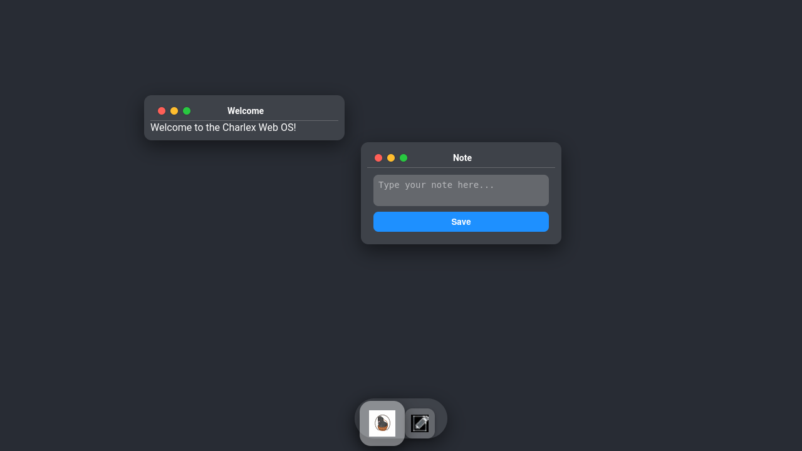

# 🖥️ CharleX WebOS — Zero-Trust Webpage as an Operating System!

A web-based operating system project built with Vanilla JavaScript ⚡.

I'm a [Googler](https://g.dev/amzy31) who loves JavaScript for its simplicity and power in the browser.



## 🚀 Quick Start

```bash
git clone https://github.com/amzy31/charlexwebos.git
cd charlexwebos
xdg-open index.html
```


## 🖥️ Features

* 🪟 Desktop and draggable windows
* 🚀 Application dock
* 📁 WebDisk / file explorer
* 📝 Notes
* 🔐 Encryption support
* 📊 System information
* 🌐 Browser application
* 🍎 macOS Theme
* 🔄 Dynamic WebOS functionality
* ⚡ Simulated reboot and halt


```text
Browser
   │
   ▼
/<PATH>/CharleXWebOS/index.html
   │
   ▼
   │
   ├── WebOS
```

## ⚡ Vanilla JavaScript

#### First I'm Googler but dont do java when I can do JavaScript! - No frameworks, no build!

* `const JavaScript = require('javascript');`
* `const CSS = require('css');`
* `const HTML = require('html');`

No React.
No Vue.
No Angular.

Just **HTML + CSS + JavaScript **.

## 🔐 Zero-Trust

CharleX WebOS follows a **Zero-Trust-inspired architecture**, BACKEND LESS & trusting the browser.

## 🎯 Project

CharleX WebOS is an experimental **web-based operating system project** focused on building a lightweight, extensible and secure OS-like environment using **Vanilla JavaScript**.

## 📜 License

MIT License.

© 2020–2026 **AMZY31**

